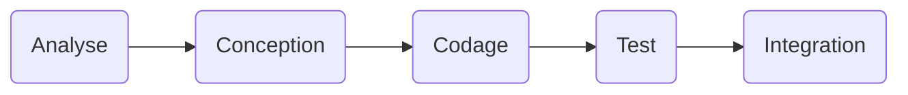

# Cycle de vie du logiciel #

## Description ##

## Implémentation ##




## Source controle ##
La gestion du code sourc e/ 
on utilise git, mais il y d'autres systèmes (subversion, mercurial). 

Le fluw quand on développe: 
```mermaid 
flowchart LR
C(code)
R(local repository)
G(github)

C--commit--> R
R--push--> G

````
Mais avant, il faut initier le reù


